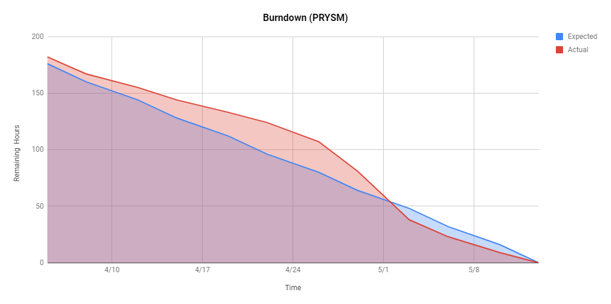
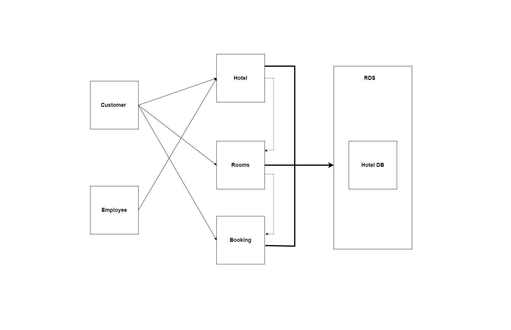
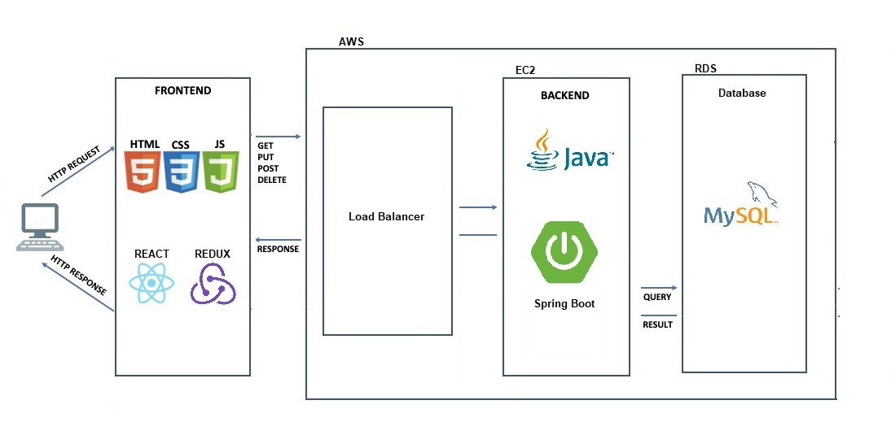

# PRYSM

Team Members:

- Prashanth Adapa (015231164)
- Rohitkumar Yadav (015222961)
- Soham Kasar (015899442) 
- Milan Joshi (015924571)

### <a href="https://github.com/gopinathsjsu/team-project-prysm">Github Repo</a>

## Responsibilities

<b>Front End, Back End</b>: Soham Kasar, Milan Joshi, Prashanth Adapa, Rohitkumar Yadav  

### <a href="https://github.com/gopinathsjsu/team-project-prysm/projects/3">Project Board</a>

### <a href="https://docs.google.com/spreadsheets/d/1O52kV-XbQbLxiX3KBoMYo03LibjcO-frWsoh8WwfL58/edit?usp=sharing">Google Sprint Task Sheet</a>

## XP Core Values

- **_Communication_**: We conducted meetings every week in-person to discuss crucial aspects of the project by collaborating and communicating with each other.
- **_Feedback_**. Team members delivered software frequently, got feedback about it, and refractored the code according to the new requirements.

<b>How the team kept the core value?  </b> 

- Team meetings were held during which diagrams were created to depict the structure of the tables in the back-end.  
- Mock-ups of how the front-end will look like on Figma.  
- Every Standup contains a discussion of the work completed, the obstacles encountered, and any deviations from the diagrams and mockups in the implementation.

## TECH STACK USED:

- Frontend: ReactJS
- Backend: Java SpringBoot
- Database: RDS MySQL
- REST API: Postman(Testing APIs)
- Cloud: AWS Elastic Beanstalk

## TASKS COMPLETED:

- Backend
  - Create all the tables as per the Schema Diagrams discussed during the meetings (initially with local sql sb)
  - Explore ec2 and Amazon Relational Database Service (RDS) using a basic schema. 
  - Added Tables:
    - Customer
    - Employee
    - Hotel
    - Room
    - Booking
    - RoomsBooked
  - Added API Calls:
    - /loginUser
    - /loginEmployee
    - /registerUser
    - /fetchHotels
    - /addHotel
    - /fetchRooms
    - /fetchCustomerHistory
    - /getHotels
    - /bookRooms
    - /cancelReservations
    - /getCustomerRewards
    - /updateReservations
    - /getCustomerLoyalty
  - Implemented Dynamic and Seasonal Pricing
  - Deploying docker image on Elastic Beanstalk (with every feature release)

- Frontend
  - Create Routing
  - Setup Redux for state management
  - Create Home page
  - Create Login and SignUp pages
  - Create Navbar
  - Create Routing on Navbar
  - Add Links to Navbar
  - Create Hotel Search
  - Create Hotel add for Employee
  - Create Booking Modal
  - Add different rooms on booking
  - Add Card View for different rooms
  - Add Amenities on Room Book
  - Create My Trips page
  - Add Card View for users Trips
  - Add Dynamic price addition on checking amenities
  - Create Rewards on Room book
  - Add Dynamic Price Deduction on room book using rewards

## UI Wireframes:

### <a href="https://www.figma.com/file/aR9uzlswdd6iCbSIW0KuRe/Prysm-202?node-id=0%3A1">Figma Link</a>

## Component Diagram:

## Architecture Diagram:

## Design Decisions:
When designing this website, we adhered to the primary concept of simplicity while focusing on the main goal at hand: allowing a user to book a hotel room in a flow that made sense to us. We created a table for each aspect of booking a hotel room: Customer, Hotel, Booking, Employee, Room, RoomsBooked. Our APIs are built around activities a user could perform to travel to a different section of the website and what the user would anticipate as a return value. We attempted to make the website as easy to use as possible. Pricing was introduced in a way that made sense to us: higher costs on Saturdays and Sundays and also Public Holidays. Prices also vary on the basis of the season - Spring, Summer, Fall and Winter.

## Feature Set:

- **User** can Login/Sign-up an account
- **User** can Make/Update/Cancel reservation.
- **User** can select location/check-in/checkout date for Hotel search
- **User** can select the type of room
- **User** can book a room with/without rewards
- **User** can select the number of rooms/people.
- Based on the **number of people** type of room will be displayed
- **Loyalty points** for user will be incrementally aded since the day user had created an account
- Hotel rates are based on **Dynamic/Seasonal Pricing**
- Booked rooms will be displayed on **My trips** pages
- **Employee** can Login as an **Admin**
- **Admin** can **Create Hotel**

# Scrum Meeting Notes

## Schedule for Scrum Meetings:
 - Tuesday
 - Friday

## Week 1:
- April 5
  - Went through project guidelines to start brainstorming 
  - who does what and finding tech stack to use (software, etc.)
  - Finalizing tech stack
  - Frontend: React JS, HTMl, CSS, JS
- April 8
  - Backend: SpringBoot with mySQL database on a RDS instance
  - Created package.json
  - Created index.js
  - Setting up basic java springboot

## Week 2:

- April 12
  - Created an RDS instance for the database
  - Created tables as per the decided schema
  - Added user, hotel and room tables
  - Inserted mock data to the tables
- April 15
  - Created user login API
  - Created user signup API
  - Tested the APIs using Postman
  - Installed node packages for react-bootstrap

## Week 3:

- April 19
  - Created Landing page for the application
  - Created Navbar with login, signup and home buttons
  - Created Modals for login and signup
  - Integrated the login/signup with their APIs
- April 22
  - Added hotel search on Home page
  - Created API for employee login
  - Created Employee login Modal
  - Created Employee login Landing Page

## Week 4:

- April 26
  - Created hotel search API
  - Created view rooms API 
  - Added component to display hotels
  - Added modals to display room data for the selected hotel
  - Added amenities for selection in the modal
- April 29
  - Added Book Room button
  - Create Book successful Modal
  - Create Boooking Error Modal
  - Created book room API
  - Integerated book room API with frontend

## Week 5:

- May 3
  - Added My Trips page in frontend
  - Created API to fetch the current bookings
  - Implemented customer loyalty logic based on their signup and bookings
  - Added feature to book a room using rewards points
  - Implemented API to update and cancel existing bookings
  - Added update booking modal on My Trips page
  - Added cancel booking button on My Trips page
- May 6
  - Implemented API to fetch all hotels as Employee
  - Implemented API to add hotel as Employee
  - Created component to display all hotels on Employee Landing Page
  - Created Modal Form to create a new hotel on Employee Landing Page
  - Integrated all the APIs

## Week 6:

- May 10
  - Implemented dynamic pricing
  - Local storage Implementation
- May 13
  - Deployed the backend application
  - Updated frontend with new API routes
  - Tested the working of the application
  - Refractor code and fixed bugs

